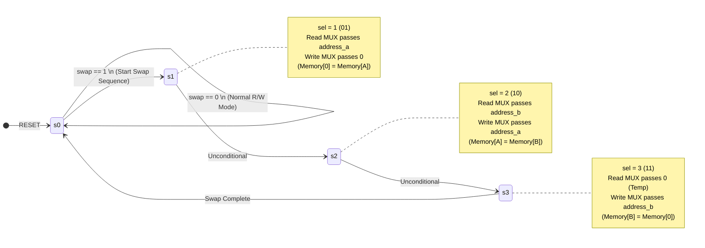

# Hardware Memory Swapper (In-Place Data Swap via FSM)

## 📌 Project Overview
This repository contains a Verilog RTL implementation of an automated **Memory Swapper Controller**. The core objective of this design is to exchange the data contents of two different memory locations (`address_a` and `address_b`) without relying on external data buffers or general-purpose registers. 

Instead, the design cleverly utilizes memory address `0` as a hidden temporary storage buffer. The swapping sequence is fully orchestrated by an integrated Finite State Machine (FSM) that controls the read/write address multiplexers (4:1 MUX) over a 3-clock-cycle operation.

## ✨ Key Features
* **In-Place Swapping:** Swaps data entirely within the memory space using `Location 0` as a dedicated swap buffer.
* **FSM Orchestration:** A 4-state Moore machine (`s0` to `s3`) perfectly times the read and write sequences to execute the swap autonomously.
* **Address Multiplexing:** Two parameterized 4:1 multiplexers dynamically route the correct addresses to the memory's `address_r` and `address_w` ports based on the active FSM state.
* **Parameterized Design:** Memory depth (`n=7`, equating to 128 locations) and data width (`data=8` bits) are fully configurable.
* **Seamless Top-Level Integration:** The `reg_swap` module encapsulates the Memory array, FSM, and Multiplexers, exposing a clean interface for standard memory operations alongside the special `swap` trigger.

---

## 🏗️ System Architecture & Datapath

The Top Module (`reg_swap`) integrates the memory block and the swapping logic. 

**Normal Operation (`swap=0`):**
* The FSM stays in `s0`. 
* Multiplexers pass external `address_r` and `address_w` directly to the memory.
* External `we` (Write Enable) controls the memory writing.

**Swap Operation (`swap=1`):**
* The FSM takes over the `we` signal (forcing it high for writes) and iterates through states `s1`, `s2`, and `s3`.
* Data read from the memory (`data_read`) is looped back directly into the write port `data_w` during the swap cycles.

---

## ⚙️ Swap Control FSM

The FSM controls the `sel` lines of the address multiplexers. The swapping algorithm using Location `0` as a temporary buffer works as follows:

1. **State `s1`:** Read from `A`, Write to `0` (Temp = Data A).
2. **State `s2`:** Read from `B`, Write to `A` (Data A = Data B).
3. **State `s3`:** Read from `0`, Write to `B` (Data B = Temp).

---

## ✅ Simulation & Verification

A testbench (`reg_swap_tb.v`) is provided to verify the swap logic dynamically. 

**Verification Flow:**
1. **Memory Initialization:** The testbench writes sequential data into memory addresses `20` through `29` (e.g., Data at Address 22 = 22, Data at Address 28 = 28).
2. **Trigger Swap:** It sets `address_a = 22` and `address_b = 28`, then pulses the `swap` signal high.
3. **Observation:** Over the next 3 clock edges, the FSM transitions through `s1`, `s2`, and `s3`. By inspecting the memory array in simulation (e.g., via Vivado or ModelSim waveforms), you can verify that Address 22 now contains `28`, Address 28 contains `22`, and Address 0 holds the temporary value `22`.
